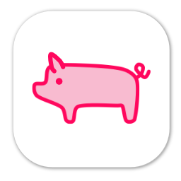

<div align="center">
	
	<h1>🌊 Deck.Surf - The Open Stream Deck CLI & Tooling</h1>
	<p>
		<b>Lightweight and open way to manage your Stream Deck device.</b>
	</p>
	<br>
	<br>
	<br>
</div>

The goal of this project is to create open, lightweight, and accessible tooling to manage a Stream Deck device without worrying about [random code looking over your machine](https://twitter.com/DennisCode/status/1401230392527523856).

## How It Works

To get started, it's necessary to create a new profile, with a set of commands that will be associated with a button on the Stream Deck. To do that, you can use the `write` command in the Piglet CLI.

```bash
Usage:
  piglet write [options] 

Options:
  -d, --device-index <device-index> (REQUIRED)  Index of the connected device, to which a key setting should be
                                                written. [default: -1]
  -k, --key-index <key-index> (REQUIRED)        Index of the key that needs to be written. [default: -1]
  -l, --plugin <plugin> (REQUIRED)              Plugin that contains the relevant command. [default: ]
  -c, --command <command> (REQUIRED)            Command to be executed. [default: ]
  -i, --image-path <image-path> (REQUIRED)      Path to the default image for the button. [default: ]
  -g, --action-args <action-args> (REQUIRED)    Arguments for the defined action. [default: ]
  -p, --profile <profile> (REQUIRED)            The profile to which the command should be added. [default: ]
  -?, -h, --help                                Show help and usage information
```

The following arguments are used, and are required:

| Argument                 | Description |
|:-------------------------|:------------|
| `--device-index` or `-d` | Zero-based index of the connected Stream Deck device. If only one device is connected, the index is `0`. |
| `--key-index` or `-k`    | Zero-based index of the key that is being written to. Should be within the boundaries of the keys for the connected device. |
| `--plugin` or `-l`       | The full identifier of the Piglet plugin that will be used for command handling. Should match the name of the plugin DLL, without the file extension. |
| `--command` or `-c`      | Command identifier. Should match the name of the command class in the plugin assembly. |
| `--image-path` or `-i`   | Path to the image that will be used for the button that is being written to. This can be the default image, that will be replaced later on through one of the commands. |
| `--action-args` or `-a`  | Arguments to pass to the command being executed. This string is specific to each command. |
| `--profile` or `-p`      | The name of the profile to be used. If no profile with a given name exists, a new one will be created. |

The created profile will be located in `%LOCALAPPDATA%\DenDev\{PROFILE_NAME}`. The settings are stored in a `profile.json` file within the profile folder.
