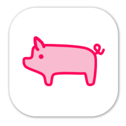

<div align="center">
	
	<h1>DeckSurf - The Open Stream Deck CLI & Tooling</h1>
	<p>
		<b>Lightweight and open way to manage your Stream Deck device.</b>
	</p>
	<br>
	<br>
	<br>
</div>

<div align="center">
	<p><a href="https://github.com/dend/decksurf-sdk">Software Development Kit</a> | <a href="https://docs.deck.surf">Documentation</a></p>
</div>

## Table of Contents

- [Installation](#installation)
- [Prerequisites](#prerequisites)
- [How It Works](#how-it-works)
- [Available CLI Commands](#available-cli-commands)
- [Included Plugin: Barn](#included-plugin-barn)
  - [LaunchApplication](#launchapplication)
  - [ShowCPUUsage](#showcpuusage)
  - [SnakeGame](#snakegame)
- [Building a Plugin](#building-a-plugin)
  - [Plugin Interface](#plugin-interface)
  - [Command Interface](#command-interface)
  - [Key SDK Types](#key-sdk-types)
  - [Plugin Deployment](#plugin-deployment)
- [Supported Devices](#supported-devices)
- [FAQ](#faq)

## Installation

DeckSurf is distributed as a .NET global tool. Install it with:

```bash
dotnet tool install -g DeckSurf
```

Once installed, the `deck` command is available from any terminal. To update to the latest version:

```bash
dotnet tool update -g DeckSurf
```

The tool includes the Barn plugin out of the box, so you can start using commands like `LaunchApplication`, `ShowCPUUsage`, and `SnakeGame` immediately.

## Prerequisites

- [.NET 10 SDK](https://dotnet.microsoft.com/download/dotnet/10.0)
- A supported Elgato Stream Deck device (XL, XL 2022, Plus, Original, Original 2019, MK.2, Mini, Mini 2022, Neo)
- **Windows:** The Elgato Stream Deck software must be closed before running DeckSurf (it holds exclusive USB access)
- **macOS:** USB entitlements (`com.apple.security.device.usb`) are required
- **Linux:** udev rules must be configured for Stream Deck USB access

## How It Works

To get started, it's necessary to create a new profile, with a set of commands that will be associated with a button on the Stream Deck. To do that, you can use the `write` command in the DeckSurf CLI.

```bash
Usage:
  deck write [options] 

Options:
  -d, --device-index <device-index> (REQUIRED)  Zero-based index of the connected device. [default: -1]
  -k, --key-index <key-index> (REQUIRED)        Zero-based index of the key to configure. [default: -1]
  -n, --plugin <plugin> (REQUIRED)              Plugin ID (e.g., DeckSurf.Plugin.Barn). [default: ]
  -c, --command <command> (REQUIRED)            Command class name within the plugin. [default: ]
  -i, --image-path <image-path> (REQUIRED)      Path to the default image for the button. [default: ]
  -a, --action-args <action-args> (REQUIRED)    Arguments passed to the command. [default: ]
  -p, --profile <profile> (REQUIRED)            Profile name. Created if it does not exist. [default: ]
  -?, -h, --help                                Show help and usage information
```

The following arguments are used, and are required:

| Argument                 | Description |
|:-------------------------|:------------|
| `--device-index` or `-d` | Zero-based index of the connected Stream Deck device. If only one device is connected, the index is `0`. |
| `--key-index` or `-k`    | Zero-based index of the key that is being written to. Should be within the boundaries of the keys for the connected device. |
| `--plugin` or `-n`       | The full identifier of the DeckSurf plugin that will be used for command handling. Should match the plugin ID (e.g., `DeckSurf.Plugin.Barn`). |
| `--command` or `-c`      | Command identifier. Should match the name of the command class in the plugin assembly. |
| `--image-path` or `-i`   | Path to the image that will be used for the button that is being written to. This can be the default image, that will be replaced later on through one of the commands. |
| `--action-args` or `-a`  | Arguments to pass to the command being executed. This string is specific to each command. |
| `--profile` or `-p`      | The name of the profile to be used. If no profile with a given name exists, a new one will be created. |

The created profile will be located in `%LOCALAPPDATA%\Den.Dev\DeckSurf\Profiles\{PROFILE_NAME}`. The settings are stored in a `profile.json` file within the profile folder.

## Available CLI Commands

| Command        | Description |
|:---------------|:------------|
| `deck devices list` | List all connected Stream Deck devices. |
| `deck devices info` | Show detailed information about a connected device. |
| `deck devices brightness` | Set the brightness level of a connected device. |
| `deck plugins list` | List all available plugins and their commands. |
| `deck profiles list` | List all saved profiles. |
| `deck profiles show <name>` | Show details and button mappings for a profile. |
| `deck profiles delete <name>` | Delete a saved profile. |
| `deck write`   | Write a button configuration to a profile. |
| `deck listen`  | Start listening for button presses on a configured profile. |

## Included Plugin: Barn

DeckSurf ships with **DeckSurf.Plugin.Barn**, a built-in plugin that demonstrates the plugin system and provides useful commands out of the box. All Barn commands are compatible with every supported Stream Deck model.

| Command | Description |
|:--------|:------------|
| `LaunchApplication` | Launch any application from a Stream Deck button. |
| `ShowCPUUsage` | Display live CPU usage percentage on a button. |
| `SnakeGame` | Play a game of snake directly on the Stream Deck button grid. |

### LaunchApplication

Launches an application when the mapped button is pressed. On activation, it automatically extracts the file icon from the target executable and displays it on the button (Windows only). If a custom `--image-path` is provided in the profile, that image is used instead.

**Usage example:**

```bash
deck write -d 0 -k 5 -n DeckSurf.Plugin.Barn -c LaunchApplication -i "" -a "C:\Windows\System32\notepad.exe" -p myprofile
```

The `--action-args` (`-g`) value is the full path to the executable to launch.

### ShowCPUUsage

Displays a live-updating system-wide CPU usage percentage on the mapped button. The display refreshes every 2 seconds. On Windows, the percentage is rendered as red text on a black background. On macOS and Linux, the button color shifts from green (low usage) through yellow to red (high usage).

**Usage example:**

```bash
deck write -d 0 -k 10 -n DeckSurf.Plugin.Barn -c ShowCPUUsage -i "" -a "" -p myprofile
```

No arguments are required for this command.

### SnakeGame

A fully playable game of snake that runs on the Stream Deck button grid. The snake moves automatically once per second, and you steer it by pressing buttons on the device. Press a button above or below the snake's head to change vertical direction, or left/right to change horizontal direction. The snake wraps around the edges of the grid.

**Usage example:**

```bash
deck write -d 0 -k 0 -n DeckSurf.Plugin.Barn -c SnakeGame -i "" -a "" -p myprofile
```

The game uses the device's full button grid (e.g., 8x4 on the XL). Snake segments are displayed as white buttons and empty space is black.

## Building a Plugin

DeckSurf uses a plugin architecture powered by the [DeckSurf SDK](https://github.com/dend/decksurf-sdk). Plugins are .NET class libraries that implement the `IDeckSurfPlugin` and `IDeckSurfCommand` interfaces.

### Plugin Interface

Each plugin must implement `IDeckSurfPlugin`:

```csharp
using DeckSurf.SDK.Interfaces;
using DeckSurf.SDK.Models;

public class Plugin : IDeckSurfPlugin
{
    public PluginMetadata Metadata => new()
    {
        Author = "Your Name",
        Id = "DeckSurf.Plugin.YourPlugin",
        Version = "1.0.0",
        Website = "https://example.com"
    };

    public List<Type> GetSupportedCommands()
    {
        return new List<Type>() { typeof(YourCommand) };
    }
}
```

### Command Interface

Each command implements `IDeckSurfCommand` (which extends `IDisposable`):

```csharp
using DeckSurf.SDK.Interfaces;
using DeckSurf.SDK.Models;

[CompatibleWith(DeviceModel.XL)]
class YourCommand : IDeckSurfCommand
{
    public string Name => "Your Command";
    public string Description => "Description of the command.";

    public void ExecuteOnActivation(CommandMapping mappedCommand, IConnectedDevice mappedDevice)
    {
        // Called when the command is loaded and the device is initialized.
    }

    public void ExecuteOnAction(CommandMapping mappedCommand, IConnectedDevice mappedDevice, int activatingButton = -1)
    {
        // Called when the mapped button is pressed.
    }

    public void Dispose()
    {
        // Clean up any resources (timers, handles, etc.)
    }
}
```

### Key SDK Types

| Type | Description |
|:-----|:------------|
| `IConnectedDevice` | Represents a connected Stream Deck device. Provides properties like `ButtonResolution`, `ButtonColumns`, `ButtonRows`, `Model`, `Serial`, and methods like `SetKey()`, `SetKeyColor()`, `SetBrightness()`, `ClearButtons()`. |
| `CommandMapping` | Maps a button index to a plugin, command, arguments, and image path. |
| `DeviceColor` | RGB color struct with built-in presets (`Black`, `White`, `Red`, etc.). |
| `DeviceModel` | Enum for supported device models. |
| `ButtonEventKind` | Enum with `Down` and `Up` values for button press events. |
| `ImageHelper` | Utility for image resizing, blank image creation, and Windows file icon extraction. |
| `ConfigurationHelper` | Manages profile loading and saving. |

### Plugin Deployment

Plugin DLLs must follow the naming convention `DeckSurf.Plugin.*.dll` and be placed in a `plugins/{PluginName}/` subdirectory relative to the `deck` executable.

## Supported Devices

| Device | Buttons | Grid | Button Resolution |
|:-------|:--------|:-----|:------------------|
| Stream Deck Original / 2019 / MK.2 | 15 | 5x3 | 72x72 px |
| Stream Deck XL / XL 2022 | 32 | 8x4 | 96x96 px |
| Stream Deck Mini / Mini 2022 | 6 | 3x2 | 80x80 px |
| Stream Deck Neo | 8 | 4x2 | 96x96 px |
| Stream Deck Plus | 8 | 4x2 | 120x120 px |

The Stream Deck Plus and Neo also support LCD screen output via `IConnectedDevice.SetScreen()`.

## FAQ

### Why was this project created?

The Stream Deck is a great piece of hardware, but the official software is closed-source and opaque. I created DeckSurf to build an open, hackable alternative — by reverse engineering the USB HID protocol that the Stream Deck uses, I wanted to give developers and tinkerers full control over their devices without relying on proprietary tooling. The goal is an open ecosystem where anyone can extend, automate, and integrate their Stream Deck however they see fit.

### Is this official/endorsed by Elgato?

No - not in any capacity. Use at your own leisure and risk.

### Where can I go to read more about the project?

This repository generally should be a good starting point, but you can also go to [https://deck.surf](https://deck.surf) for latest links and relevant information.

### Can I run this on Linux/macOS?

Starting with DeckSurf SDK 0.0.7, the underlying SDK supports Windows, macOS, and Linux. Cross-platform support in the CLI tooling is a work in progress.

### Is there a GUI management app for this?

Not yet - it's just a CLI and a .NET SDK. In the future, I expect to also create a more visual approach to managing the content, that is easier for folks that don't want to fiddle with the terminal.
