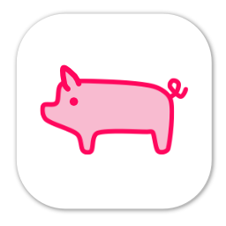

<div align="center">
	
	<h1>DeckSurf - The Open Stream Deck CLI & Tooling</h1>
	<p>
		<b>Lightweight and open way to manage your Stream Deck device.</b>
	</p>
	<br>
	<br>
	<br>
</div>

<div align="center">
	<p><a href="https://github.com/dend/decksurf-sdk">Software Development Kit</a> | <a href="https://docs.deck.surf">Documentation</a></p>
</div>

## Table of Contents

- [Installation](#installation)
  - [CLI](#cli)
  - [Windows App](#windows-app)
- [Prerequisites](#prerequisites)
- [How It Works](#how-it-works)
- [Available CLI Commands](#available-cli-commands)
- [Included Plugin: Barn](#included-plugin-barn)
  - [LaunchApplication](#launchapplication)
  - [ShowCPUUsage](#showcpuusage)
  - [ShowRAMUsage](#showramusage)
  - [ShowNetworkTraffic](#shownetworktraffic)
  - [ShowTimer](#showtimer)
  - [KnobBrightness](#knobbrightness)
  - [SnakeGame](#snakegame)
- [Building a Plugin](#building-a-plugin)
  - [Plugin Deployment](#plugin-deployment)
- [Supported Devices](#supported-devices)
- [FAQ](#faq)

## Installation

### CLI

DeckSurf is distributed as a .NET global tool. Install it with:

```bash
dotnet tool install -g DeckSurf
```

Once installed, the `deck` command is available from any terminal. To update to the latest version:

```bash
dotnet tool update -g DeckSurf
```

The tool includes the Barn plugin out of the box, so commands like `LaunchApplication`, `ShowCPUUsage`, and `ShowTimer` work immediately.

### Windows App

DeckSurf for Windows is a native WinUI 3 app for managing devices, profiles, and plugins visually. It includes a profile editor, a device and plugin browser, and an always-on tray runtime that keeps your profile active in the background.

The app ships as a self-contained MSI (`DeckSurf.msi`) attached to `app-*` tagged [GitHub releases](https://github.com/dend/decksurf/releases). It does not require a separate .NET installation. If you want to build it yourself, run `scripts/build-installer.ps1` from the repository root.

## Prerequisites

- [.NET 10 SDK](https://dotnet.microsoft.com/download/dotnet/10.0) for the CLI (the Windows app MSI is self-contained)
- A supported Elgato Stream Deck device (XL, XL 2022, Plus, Original, Original 2019, MK.2, Mini, Mini 2022, Neo)
- **Windows:** The Elgato Stream Deck software must be closed before running DeckSurf (it holds exclusive USB access)
- **macOS:** USB entitlements (`com.apple.security.device.usb`) are required
- **Linux:** udev rules must be configured for Stream Deck USB access

## How It Works

To get started, it's necessary to create a new profile, with a set of commands that will be associated with a button on the Stream Deck. To do that, you can use the `write` command in the DeckSurf CLI.

```bash
Usage:
  deck write [options] 

Options:
  -d, --device-index <device-index> (REQUIRED)  Zero-based index of the connected device. [default: -1]
  -s, --device-serial <device-serial>           Serial number of the target device. Takes precedence over --device-index and is stable across sessions. [default: ]
  -k, --key-index <key-index> (REQUIRED)        Zero-based index of the key to configure. [default: -1]
  -n, --plugin <plugin> (REQUIRED)              Plugin ID (e.g., DeckSurf.Plugin.Barn). [default: ]
  -c, --command <command> (REQUIRED)            Command class name within the plugin. [default: ]
  -i, --image-path <image-path> (REQUIRED)      Path to the default image for the button. [default: ]
  -a, --action-args <action-args> (REQUIRED)    Arguments passed to the command, as comma-separated key=value pairs (e.g. "scene=Gaming,port=4455"). [default: ]
  -p, --profile <profile> (REQUIRED)            Profile name. Created if it does not exist. [default: ]
  -?, -h, --help                                Show help and usage information
```

The following arguments are used, and are required:

| Argument                 | Description |
|:-------------------------|:------------|
| `--device-index` or `-d` | Zero-based index of the connected Stream Deck device. If only one device is connected, the index is `0`. |
| `--device-serial` or `-s` | Optional. Serial number of the target device, as shown by `deck devices list`. When provided it takes precedence over `--device-index`, which is useful because USB enumeration order can change between sessions. |
| `--key-index` or `-k`    | Zero-based index of the key that is being written to. Should be within the boundaries of the keys for the connected device. |
| `--plugin` or `-n`       | The full identifier of the DeckSurf plugin that will be used for command handling. Should match the plugin ID (e.g., `DeckSurf.Plugin.Barn`). |
| `--command` or `-c`      | Command identifier. Should match the name of the command class in the plugin assembly. |
| `--image-path` or `-i`   | Path to the image that will be used for the button that is being written to. This can be the default image, that will be replaced later on through one of the commands. |
| `--action-args` or `-a`  | Arguments to pass to the command, written as comma-separated `key=value` pairs (e.g., `mode=timer,duration=300`). Run `deck plugins list` to see the parameters each command accepts. Pass `""` for commands that take none. |
| `--profile` or `-p`      | The name of the profile to be used. If no profile with a given name exists, a new one will be created. |

The created profile will be located in `%LOCALAPPDATA%\Den.Dev\DeckSurf\Profiles\{PROFILE_NAME}`. The settings are stored in a `profile.json` file within the profile folder. When the target device is connected at write time, the profile records its serial number and model, and tools like `deck listen` and the DeckSurf for Windows app use that serial to find the device again regardless of USB enumeration order.

## Available CLI Commands

| Command        | Description |
|:---------------|:------------|
| `deck devices list` | List all connected Stream Deck devices. |
| `deck devices info` | Show detailed information about a connected device. |
| `deck devices brightness` | Set the brightness level of a connected device. |
| `deck plugins list` | List all available plugins, their commands, and the parameters each command accepts. |
| `deck profiles list` | List all saved profiles. |
| `deck profiles show <name>` | Show details and button mappings for a profile. |
| `deck profiles delete <name>` | Delete a saved profile. |
| `deck write`   | Write a button configuration to a profile. |
| `deck listen`  | Start listening for button presses on a configured profile. |

## Included Plugin: Barn

DeckSurf ships with **DeckSurf.Plugin.Barn**, a built-in plugin that demonstrates the plugin system and provides useful commands out of the box.

| Command | Description |
|:--------|:------------|
| `LaunchApplication` | Launch an application, document, or URL from a Stream Deck button. |
| `ShowCPUUsage` | Display live CPU usage on a button. |
| `ShowRAMUsage` | Display live RAM usage on a button. |
| `ShowNetworkTraffic` | Display live network upload and download speeds. |
| `ShowTimer` | Clock, stopwatch, or countdown timer on a button. |
| `KnobBrightness` | Adjust device brightness with a knob (Stream Deck Plus only). |
| `SnakeGame` | Play a game of snake directly on the Stream Deck button grid. |

All commands work on every supported Stream Deck model except `KnobBrightness`, which requires the knobs on the Stream Deck Plus.

### LaunchApplication

Launches the target when the mapped button is pressed. The target can be an executable, a document, or a URL. On macOS the target is opened through `open`, and on Linux through `xdg-open`, so `.app` bundles and desktop files behave correctly. On Windows, the command extracts the file icon from the target executable on activation and displays it on the button. If a custom `--image-path` is provided in the profile, that image is used instead.

**Usage example:**

```bash
deck write -d 0 -k 5 -n DeckSurf.Plugin.Barn -c LaunchApplication -i "" -a "path=C:\Windows\System32\notepad.exe" -p myprofile
```

The `path` argument is the full path (or URL) to open. Older profiles that stored a bare path as the argument string continue to work.

### ShowCPUUsage

Displays system-wide CPU usage on the mapped button, sampled once per second. The button shows the current percentage along with a small history graph of recent samples. Rendering is identical on Windows, macOS, and Linux.

**Usage example:**

```bash
deck write -d 0 -k 10 -n DeckSurf.Plugin.Barn -c ShowCPUUsage -i "" -a "" -p myprofile
```

No arguments are required for this command.

### ShowRAMUsage

Displays system-wide memory usage on the mapped button, in the same style as `ShowCPUUsage`: current percentage plus a history graph, refreshed once per second.

**Usage example:**

```bash
deck write -d 0 -k 11 -n DeckSurf.Plugin.Barn -c ShowRAMUsage -i "" -a "" -p myprofile
```

No arguments are required for this command.

### ShowNetworkTraffic

Displays live network upload and download speeds on the mapped button, refreshed once per second, with a history graph scaled to the peak value in the window. On the Stream Deck Plus, this command can also render on the touch strip when mapped to the screen target.

**Usage example:**

```bash
deck write -d 0 -k 12 -n DeckSurf.Plugin.Barn -c ShowNetworkTraffic -i "" -a "" -p myprofile
```

No arguments are required for this command.

### ShowTimer

Shows a clock, a stopwatch, or a countdown timer on the mapped button. In stopwatch and timer modes, pressing the button starts or pauses it, and a quick double press resets it. Clock mode is display only.

**Usage example:**

```bash
deck write -d 0 -k 3 -n DeckSurf.Plugin.Barn -c ShowTimer -i "" -a "mode=timer,duration=300" -p myprofile
```

| Argument | Description |
|:---------|:------------|
| `mode` | `clock`, `stopwatch`, or `timer`. Defaults to `clock`. |
| `duration` | Countdown length in seconds. Only used in timer mode. Defaults to `300`. |

### KnobBrightness

Adjusts device brightness with one of the knobs on the Stream Deck Plus. Rotating the knob raises or lowers brightness by a configurable step (`step`, default `5`), and pressing it toggles the backlight off and back on.

Because `deck write` targets keys, knob mappings are currently created through the DeckSurf for Windows profile editor, or by setting `"target": "Knob"` on a mapping in `profile.json`, where `button_index` is the zero-based knob index.

### SnakeGame

A fully playable game of snake that runs on the Stream Deck button grid. The snake moves automatically once per second, and you steer it by pressing buttons on the device. Press a button above or below the snake's head to change vertical direction, or left/right to change horizontal direction. The snake wraps around the edges of the grid.

**Usage example:**

```bash
deck write -d 0 -k 0 -n DeckSurf.Plugin.Barn -c SnakeGame -i "" -a "" -p myprofile
```

The game uses the device's full button grid (e.g., 8x4 on the XL). Snake segments are displayed as white buttons and empty space is black.

## Building a Plugin

DeckSurf uses a plugin architecture powered by the [DeckSurf SDK](https://github.com/dend/decksurf-sdk). Plugins are .NET class libraries that implement two interfaces:

- [`IDeckSurfPlugin`](https://docs.deck.surf/api/DeckSurf.SDK.Interfaces/DeckSurf.SDK.Interfaces.IDeckSurfPlugin.html) describes the plugin through its [`PluginMetadata`](https://docs.deck.surf/api/DeckSurf.SDK.Models/DeckSurf.SDK.Models.PluginMetadata.html) and lists the commands it exposes.
- [`IDeckSurfCommand`](https://docs.deck.surf/api/DeckSurf.SDK.Interfaces/DeckSurf.SDK.Interfaces.IDeckSurfCommand.html) implements a single command: it runs code when a profile is activated, when the mapped button is pressed, and, for commands that react to knobs, touch, or button-up events, on every raw device event.

Commands declare their arguments with [`CommandParameterAttribute`](https://docs.deck.surf/api/DeckSurf.SDK.Models/DeckSurf.SDK.Models.CommandParameterAttribute.html), which makes them show up in `deck plugins list` and gives them proper input controls in the DeckSurf for Windows profile editor. At runtime, values are read through [`CommandArguments`](https://docs.deck.surf/api/DeckSurf.SDK.Models/DeckSurf.SDK.Models.CommandArguments.html). Commands that only work on certain hardware mark themselves with [`CompatibleWithAttribute`](https://docs.deck.surf/api/DeckSurf.SDK.Models/DeckSurf.SDK.Models.CompatibleWithAttribute.html), and the device itself is driven through [`IConnectedDevice`](https://docs.deck.surf/api/DeckSurf.SDK.Interfaces/DeckSurf.SDK.Interfaces.IConnectedDevice.html).

The full API reference lives at [docs.deck.surf](https://docs.deck.surf), and the [Barn plugin source](src/DeckSurf/DeckSurf.Plugin.Barn) in this repository is a working example of all of the above.

### Plugin Deployment

Plugin DLLs must follow the naming convention `DeckSurf.Plugin.*.dll`. They are discovered in a `plugins/` directory next to the `deck` executable (scanned recursively, so `plugins/{PluginName}/` works well as a layout), or directly next to the executable itself. If the same assembly appears in both places, the `plugins/` copy wins.

## Supported Devices

| Device | Buttons | Grid | Button Resolution |
|:-------|:--------|:-----|:------------------|
| Stream Deck Original / 2019 / MK.2 | 15 | 5x3 | 72x72 px |
| Stream Deck XL / XL 2022 | 32 | 8x4 | 96x96 px |
| Stream Deck Mini / Mini 2022 | 6 | 3x2 | 80x80 px |
| Stream Deck Neo | 8 | 4x2 | 96x96 px |
| Stream Deck Plus | 8 | 4x2 | 120x120 px |

The Stream Deck Plus and Neo also support LCD screen output via [`IConnectedDevice.SetScreen()`](https://docs.deck.surf/api/DeckSurf.SDK.Interfaces/DeckSurf.SDK.Interfaces.IConnectedDevice.html).

## FAQ

### Why was this project created?

The Stream Deck is a great piece of hardware, but the official software is closed-source and opaque. I created DeckSurf to build an open, hackable alternative. By reverse engineering the USB HID protocol that the Stream Deck uses, I wanted to give developers and tinkerers full control over their devices without relying on proprietary tooling. The goal is an open ecosystem where anyone can extend, automate, and integrate their Stream Deck however they see fit.

### Is this official/endorsed by Elgato?

No - not in any capacity. Use at your own leisure and risk.

### Where can I go to read more about the project?

This repository generally should be a good starting point, but you can also go to [https://deck.surf](https://deck.surf) for latest links and relevant information.

### Can I run this on Linux/macOS?

Starting with DeckSurf SDK 0.0.7, the underlying SDK supports Windows, macOS, and Linux. Cross-platform support in the CLI tooling is a work in progress.

### Is there a GUI management app for this?

On Windows, yes. DeckSurf for Windows is a native WinUI 3 app with a profile editor, a device and plugin browser, and a tray runtime that keeps your profile active without a terminal window. See [Windows App](#windows-app) for installation. On macOS and Linux, it's CLI only for now.
